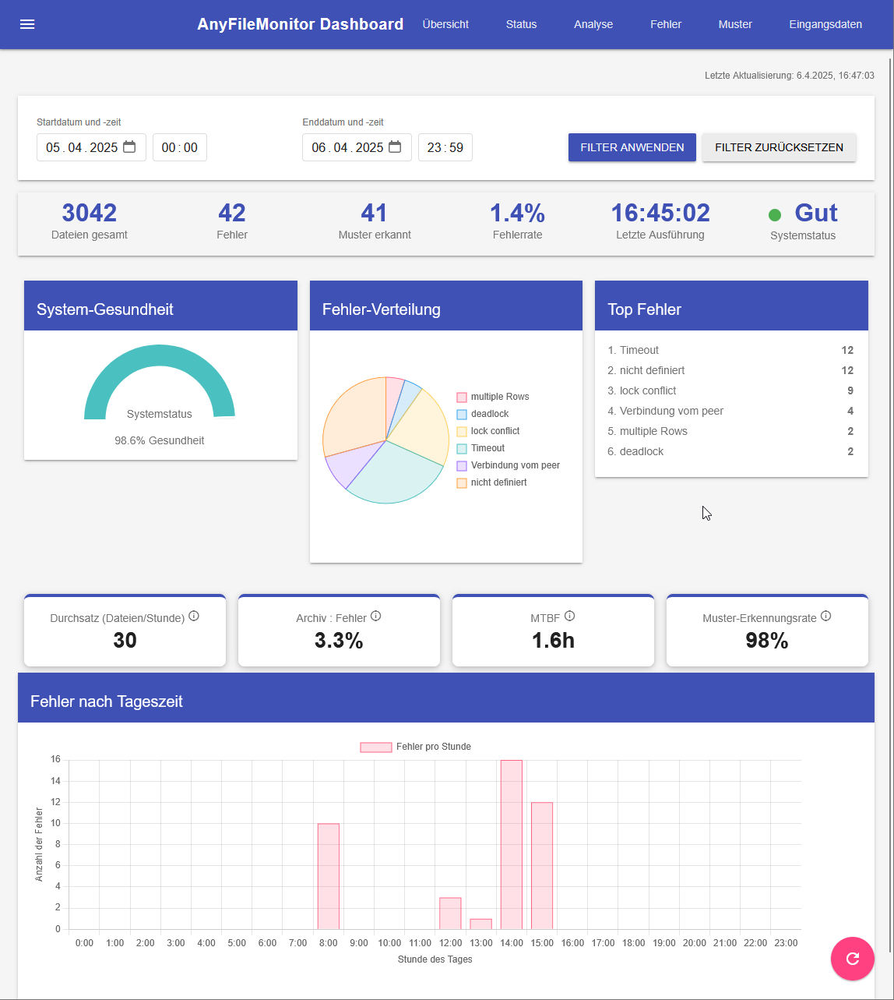
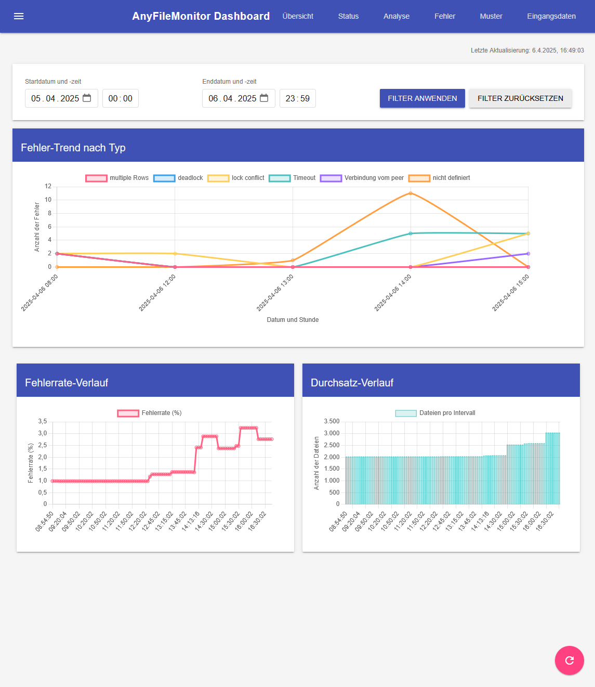
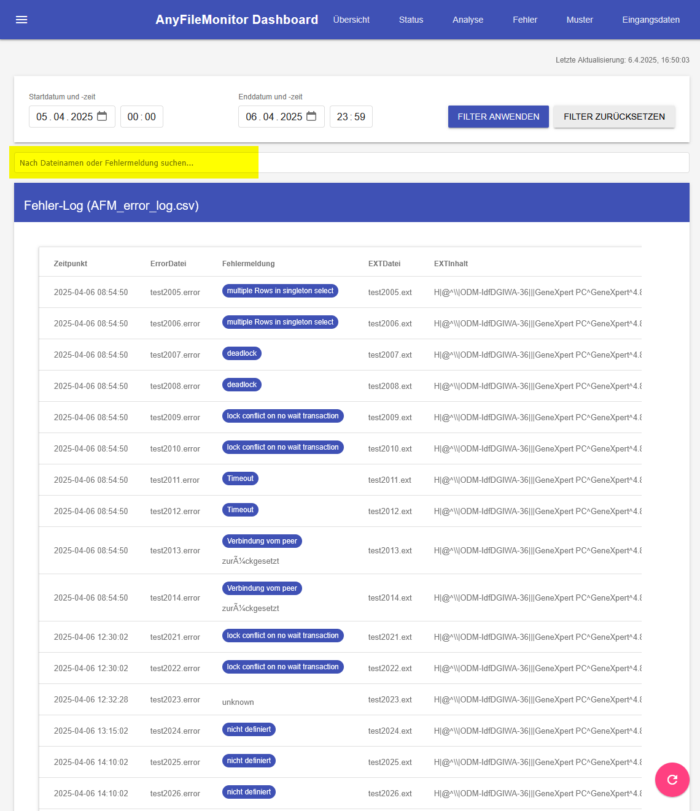
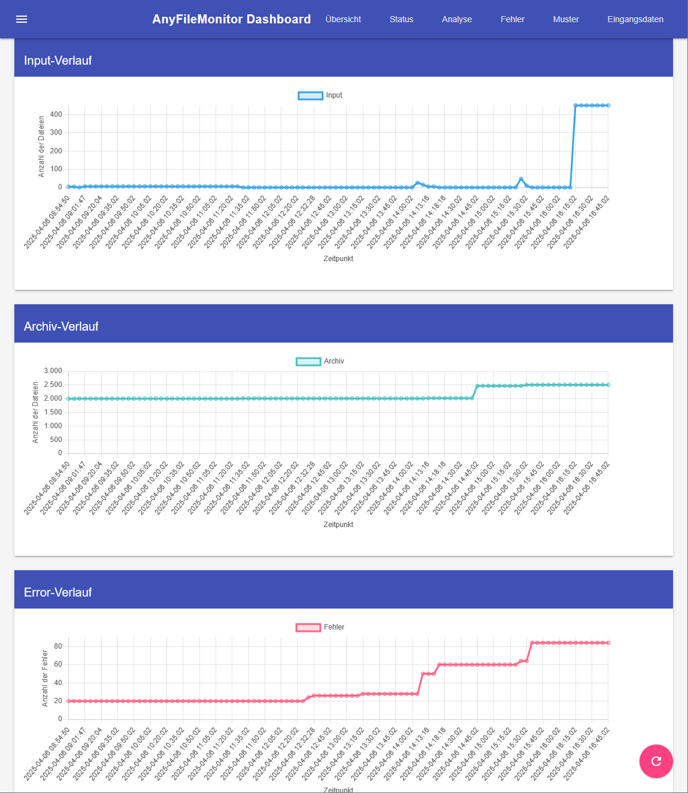

# 📊 AFM Dashboard

Das **AnyFileMonitor Dashboard** ist eine HTML5-basierte, interaktive Visualisierung der AFM-Logdateien. Es dient der schnellen Analyse von verarbeiteten Dateien, Fehlern, Mustern und Eingängen – vollständig offlinefähig, mobilfreundlich und sofort einsatzbereit.



---

## 🚀 Live-Demo

📍 [afm.madmoench.de](https://afm.madmoench.de/) – öffentlich gehostet via GitHub Pages.

---

## 📁 Benötigte Dateien (im gleichen Ordner wie `index.html`)

- `AFM_status_log.csv` – erfolgreich verarbeitete Dateien
- `AFM_error_log.csv` – Fehlerhafte Dateien + zugehörige Informationen
- `AFM_input_details.csv` – Eingangsdaten inkl. Dateigröße und Zeitstempel
- `AFM_pattern_matches.csv` – (optional) Mustererkennungen basierend auf Fehlermeldungen
- `libs/` – lokale JS- und CSS-Abhängigkeiten (Papaparse, Chart.js, Material Design etc.)

---

## 🧠 Funktionen

- 🔀 **Tab-Navigation**: Status, Fehler, Eingänge, Muster
- 🔍 **Filter & Suche**: In allen Tabellen möglich
- 📈 **Charts & Visualisierung**: Balken-, Linien- und Gaugediagramme
- 📄 **CSV-Dateien werden dynamisch geladen**: Keine Umwandlung nötig
- 📱 **Mobilfähig & responsive**: Funktioniert auf Smartphone & Tablet
- 🔒 **Vollständig offlinefähig**: Keine CDN-Abhängigkeit dank `libs/`

### Dashboard-Ansichten

#### Übersichtsseite


#### Fehleranalyse


#### Statusverlauf


---

## 📊 Ressourcenverbrauch

Das Dashboard ist sehr ressourcenschonend konzipiert:

- 🖥️ **Webserver**: Minimaler Verbrauch (~5-10 MB RAM), da nur statische Dateien ausgeliefert werden
- ⏱️ **5-Minuten-Task**: Vernachlässigbare CPU-Last (< 0,1%) bei regelmäßiger Aktualisierung
- 🔄 **Browser**: ~50-80 MB RAM (abhängig vom Browser und Datenmenge)
- 💾 **Festplatte**: < 5 MB für alle Dashboard-Dateien plus CSV-Logs
- 🌐 **Netzwerk**: Nur initiale Ladezeit, danach minimaler Traffic bei Aktualisierungen (wenige KB)

Die clientseitige Verarbeitung und das stateless Design sorgen dafür, dass selbst auf älteren Systemen oder Umgebungen mit beschränkten Ressourcen ein reibungsloser Betrieb möglich ist.

---

## ⚙️ Verwendung (lokal)

1. Stelle sicher, dass alle CSV-Dateien im selben Ordner wie `index.html` liegen
2. Starte mit lokalem Webserver (z. B. via PowerShell):
```powershell
.\Start-AFM-Dashboard.ps1
```
3. Öffne `http://localhost:8080/` im Browser

Oder:
- Lade das Dashboard über GitHub Pages oder Webserver deiner Wahl

---

## 📌 Hinweis zu CORS / Sicherheit

Das Dashboard **funktioniert nicht direkt per `file:///`-Aufruf in Firefox/Chrome**, da lokale Dateien von JavaScript nicht eingelesen werden dürfen (CORS-Policy). Verwende daher einen lokalen Server oder GitHub Pages.

---

## 🔗 GitHub Repository

[github.com/Sierra-Bravo-ger/AnyFileMonitor](https://github.com/Sierra-Bravo-ger/AnyFileMonitor)

---

## 📄 Lizenz

Dieses Projekt ist für die interne Verwendung bestimmt und unterliegt keiner spezifischen Open-Source-Lizenz.
